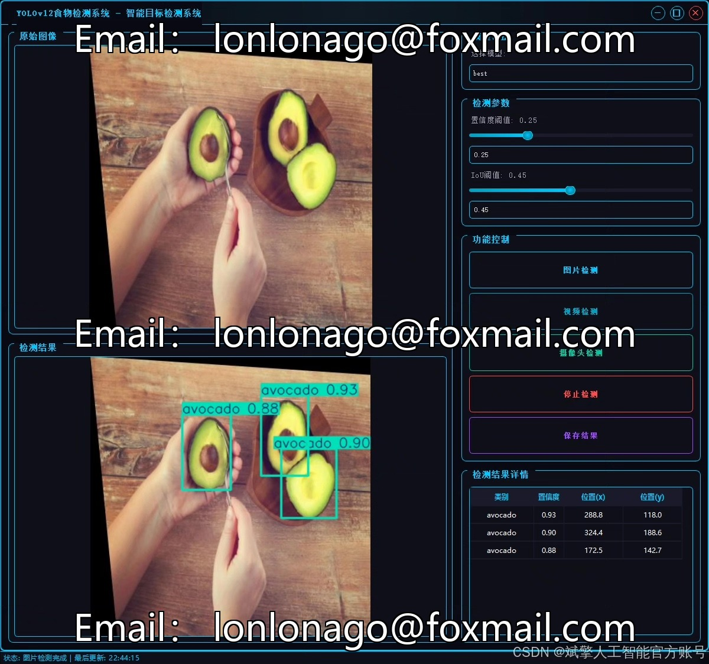
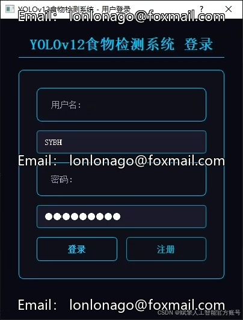
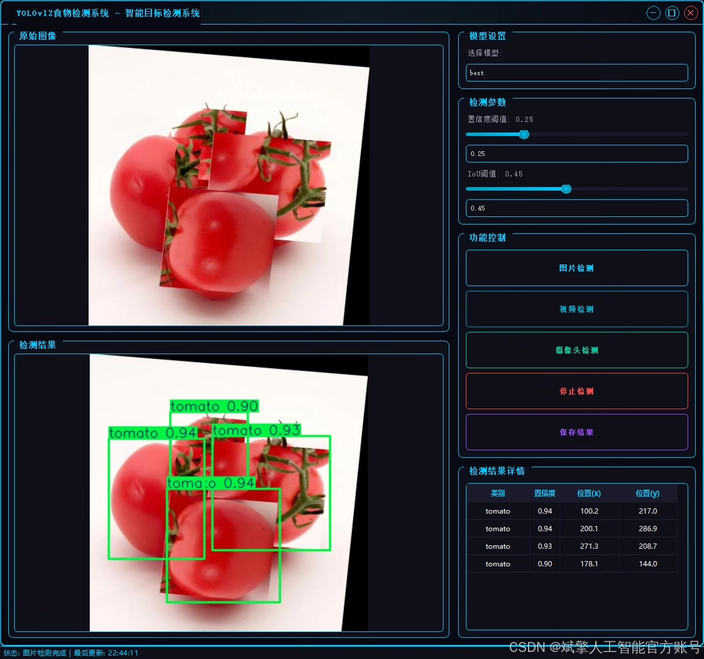
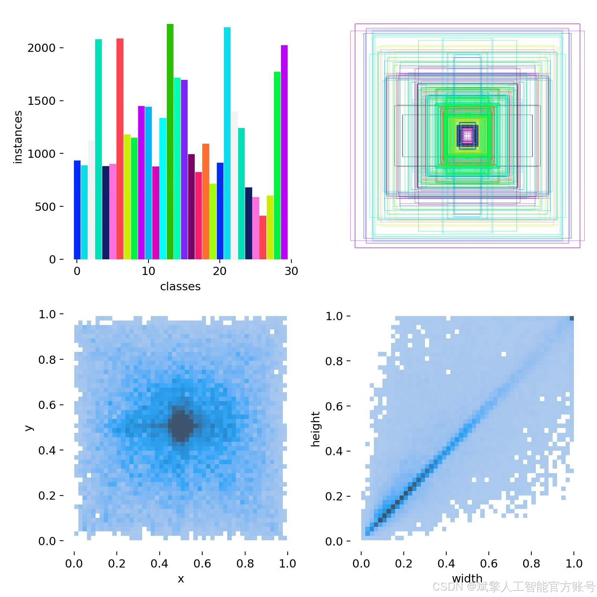
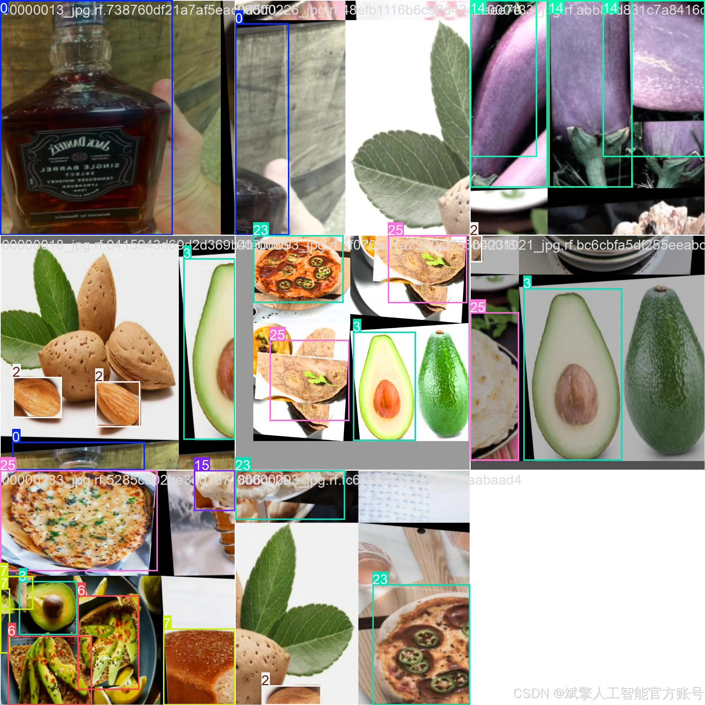
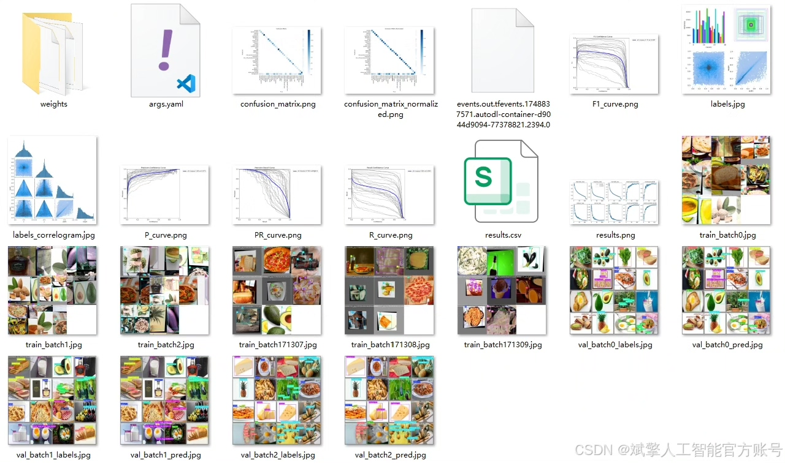
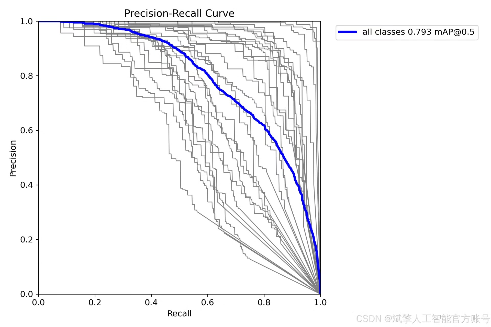
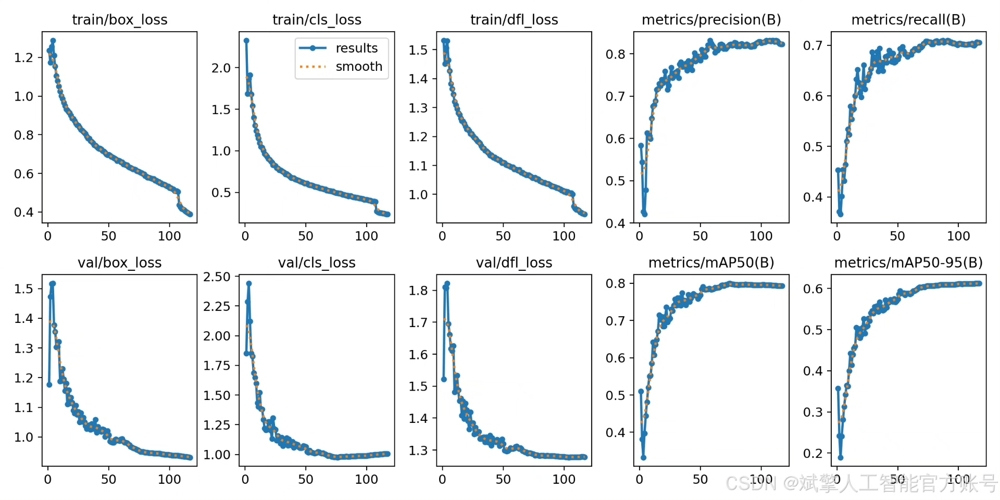
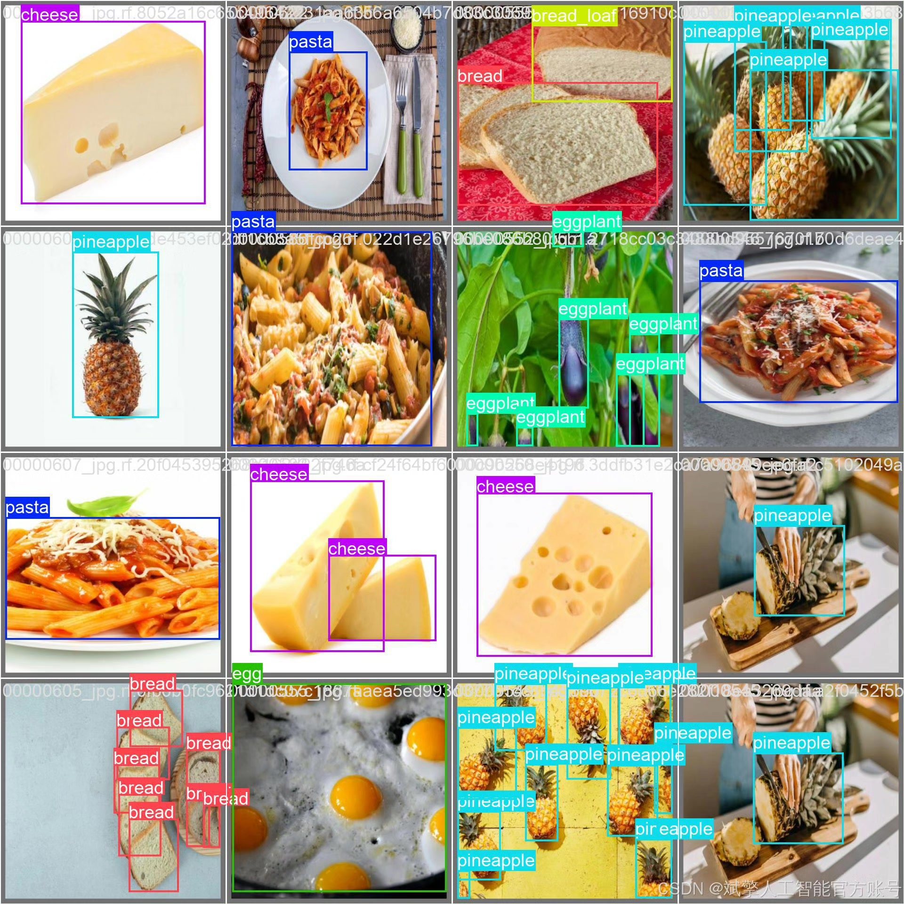

# YOLOv12 Food Detection System

## Body

This article introduces a food detection system based on the YOLOv12 deep learning model, which can recognize 30 common foods and beverages. The system utilizes the advanced YOLOv12 object detection algorithm in conjunction with a carefully constructed food dataset to achieve efficient food recognition capabilities. The project includes complete Python implementation code, pre-trained models, and a user-friendly UI interface, supporting login and registration functions. This system can be applied in scenarios such as intelligent catering management, healthy diet tracking, and food inventory management, providing a reliable automated solution for food identification and classification.

Dataset:
nc: 30 classes,
Names: ['alcohol', 'alcohol_glass', 'almond', 'avocado', 'blackberry', 'blueberry', 'bread', 'bread_loaf', 'capsicum', 'cheese', 'chocolate', 'cooked_meat', 'dates', 'egg', 'eggplant', 'icecream', 'milk', 'milk_based_beverage', 'mushroom', 'non_milk_based_beverage', 'pasta', 'pineapple', 'pistachio', 'pizza', 'raw_meat', 'roti', 'spinach', 'strawberry', 'tomato', 'whole_egg_boiled'],
Number of datasets: training set 12802, validation set 1220, test set 639.

✅ User login and registration: Supports password detection and security verification.
✅ Three detection modes: Based on the YOLOv12 model, supports image, video, and real-time camera detection, accurately recognizing targets.
✅ Dual-screen comparison: Displays original images and detection results on the same screen.
✅ Data visualization: Real-time table displaying the category, confidence, and coordinates of detected targets.
✅ Intelligent parameter adjustment: Offers a confidence slide bar, dynamically optimizing detection accuracy to meet different scene needs.
✅ Sci-fi style interactive interface: Dark theme combined with dynamic light effects, reducing visual fatigue and improving operational experience.

## Images

## Payment

Here is a pay link on Stripe ( https://buy.stripe.com/3cs8yP7sY87d0vu9AB ). Please contact me lonlonago@foxmail.com after funding $89, and I will send you a complete data files , thank you!

